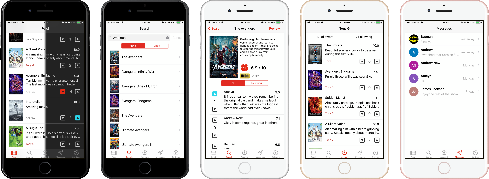

<!--#  Critique-->
<!---->




## About ##

A social media app that makes movie reviewing accessible to anyone. By allowing users to find voices they care about, following and rating interesting critics is made easy.

## Features ##

- **Review Feed**
  - See all the reviews for the critics you follow 
- **Critic Discovery & Search**
  - Find new critics and search for ones you know
- **Movie Search**
  - Learn more about a movie and/or give it a review
- **Direct Messaging**
  - Chat with other critics on the app
- **Night Mode**
  - Optional
- **Privacy Settings**
  - Set your account public/private and block selected critics

## Usage ##

1) Download the repository

```
$ git clone git@github.com:jsj/critique.git
$ cd critique
```

2) Install CocoaPods dependencies

```
$ pod install
```

3) Open the project in Xcode

```
$ open Critique.xcworkspace
```

4) Configure with personal API key information

    (Note: There is no config file for this application. All keys are embedded.)

5) Compile and run the app in your simulator

## Requirements ##

- Xcode 10.3
- iOS 12.1

## Credits ##


- [Alamofire][] for network request
- [Algolia][] for consumer-grade search
- [Firebase][] for authentication and cloud storage
- [MessageKit][] for direct messaging interface
- [NightNight][] for iOS 12 night mode framework
- [OMDb][] for movie information retrieval

[Alamofire]:https://github.com/Alamofire/Alamofire
[Algolia]:https://www.algolia.com/products/instantsearch/
[Firebase]:https://firebase.google.com/
[MessageKit]:https://github.com/MessageKit/MessageKit
[NightNight]:https://github.com/draveness/NightNight
[OMDb]:http://www.omdbapi.com
